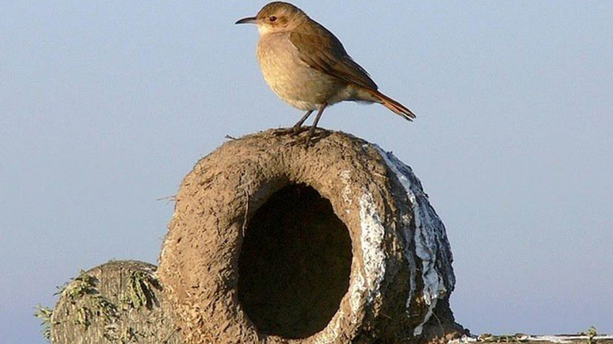
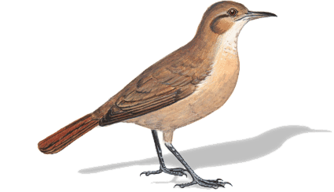
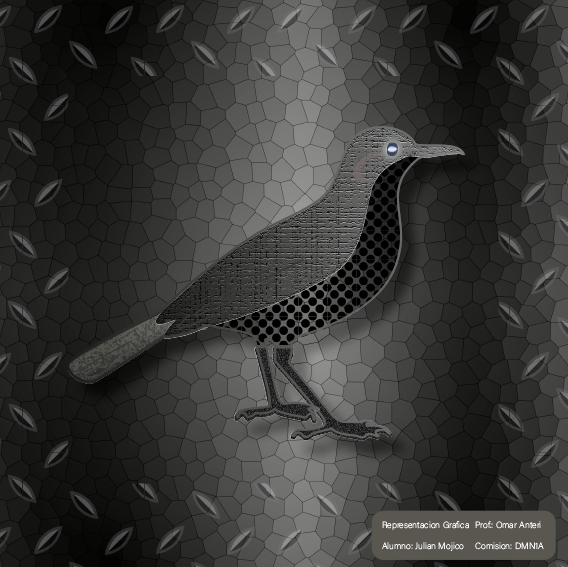
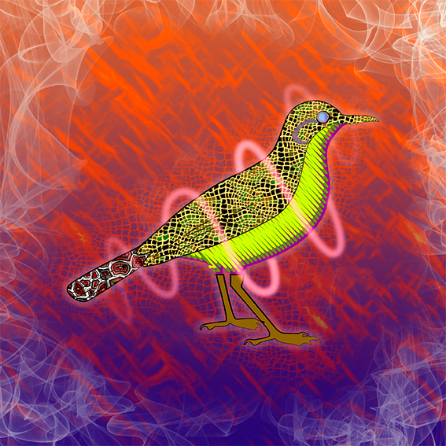
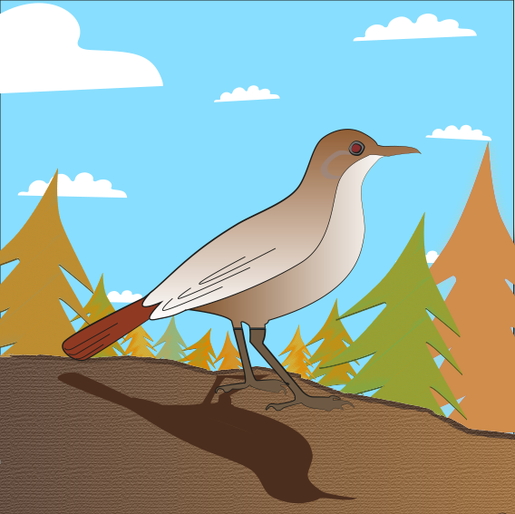

Hornero is our national bird here in Argentina. 🇦🇷
They build their houses using mud and sticks.   
It a beautiful cave where they can protect their childs from outside dangers. 🐣
And of course enjoy a great a great view above the trees. 🏞️

So well deserved
### Original

### Metalic, serious style

### Energic, explosive style

### Cartoon style
