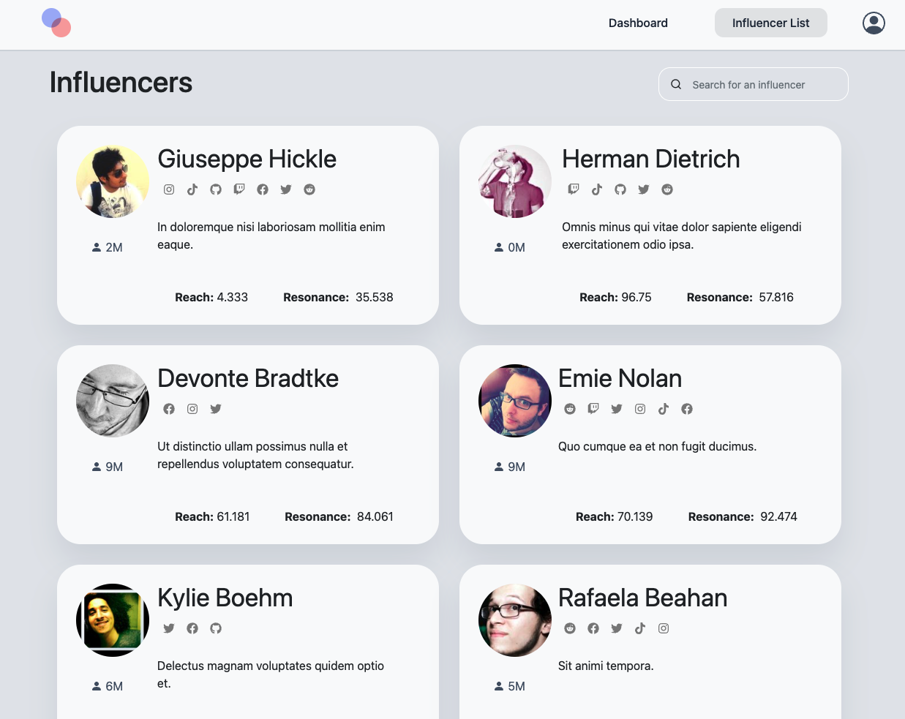
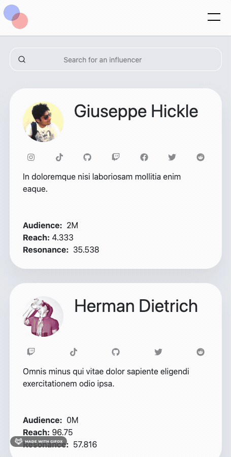

This WebApp was entirely developed in React. 🙂   
Is fully responsive 📱💻   
The entire site was prototyped in Figma 👨‍💻  
Features searchbar, dynamic pagination animated menu. ✨

####Desktop version

####Mobile version

### Visit the <a href="https://julianmojico.github.io/react-challenge/" target="_blank">site</a>👈